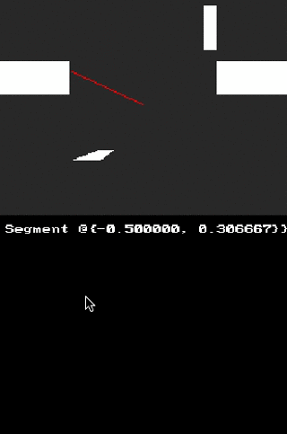

# Ray Casting Example 1
In this example we take a single ray from the origin of the screen and calculate the intersection of various objects on screen.
Again this was ported from an HTML5 example, [source](https://github.com/ncase/sight-and-light/blob/gh-pages/draft1.html).

# Preview
[]

# Code Explained
### Intro to NDS OpenGL
So this is the first introduction to OpenGL on the NDS. Fortunately, I have a decent amount of experience but it's not that extreme of a topic. Actually, I think it might be easier then what we've learned with OAM and Sprites. In any case this entire example relies on the NDS version of OpenGL, [more about that in VideoGL.h](http://libnds.devkitpro.org/videoGL_8h.html).

### The basics
We have two different types of objects on the screen. The first is the `red ray` that the stylus moves around. The second is multiple `segments` on screen. `Segments` are simply geometric shapes that we will use as a sort of wall. Walls that the ray wont go through as ray casting should.

### Understanding *Coord getIntersection(Ray ray, Ray segment);*
The `Coord getIntersection(Ray ray, Ray segment);` function is literally where the main computation of Ray Casting occures in this example. It's a monster but let's break it down into very simple understandings. I actually didn't understand this at all coming into it so through trail and a basic understanding of Ray Casting I was able to come to the conclusion below.

Ray casting requires a basic understanding of calculas. For this example it isn't extreme calculas but it helps to know it. If this is something you need to review or don't understand [this might help](http://www.dummies.com/how-to/content/how-to-find-the-derivative-of-a-line.html) refresh the topic.

#### r_p* & r_d* and s_p* & s_d* variables
`r_px` and `r_py` are are pretty easy, simply the `red line ray` origin, this is a constant.

`r_dx` and `r_dy` is the derivative of the line. We take the derivative of a line by taking the second point in the line minus the first. In calculas it would look like this:

````
dy 		y^2 - y^1		3 - 1		2	 r_dy
-- =  ------------- = --------- =  --- = ----
dx 		x^2 - y^1		3 - 1		2	 r_dx
````

Since we need both `dx` and `dy` we don't need to evaluate 2/2 = 1;
The dy/dx is important because this tells us the slope of the line, which can be understood as the ratio of change in value. This will be important to decide where the ray hits on the segments on screen later on.

The same idea for the `s_px` & `s_py` and `s_dx` & `s_dy`  but this time the `s` is the segment. If you notice the `getIntersection()` function only passes one line at a time per segment, this is because we do calculations per side.

#### r_mag and s_mag variables
````
	float r_mag = sqrt(r_dx*r_dx+r_dy*r_dy);
	float s_mag = sqrt(s_dx*s_dx+s_dy*s_dy);
````
Not getting the calculas, well maybe this next part will be a little more familiar. Here we will use the Pythagorean theorem to solve the `length` of the our `red line ray`. The line is the `c` in the Pythagorean Theorem as expect since it is the longest side of the triangle.

We'll also need the `length` of the segment line doing the same with the s_d* variables.

We also have a check to ensure that `red line ray` and the `segment` are not in the same diretion. This isn't something we'll have to worry about since the red line ray starts in the center of the screen.

#### Solving for T1 & T2
````
	float T2 = (r_dx*(s_py-r_py) + r_dy*(r_px-s_px))/(s_dx*r_dy - s_dy*r_dx);
	float T1 = (s_px+s_dx*T2-r_px)/r_dx;
````
Yep.. I don't understand this at the moment. I'm going to have to write this out a couple of times until it clicks.
